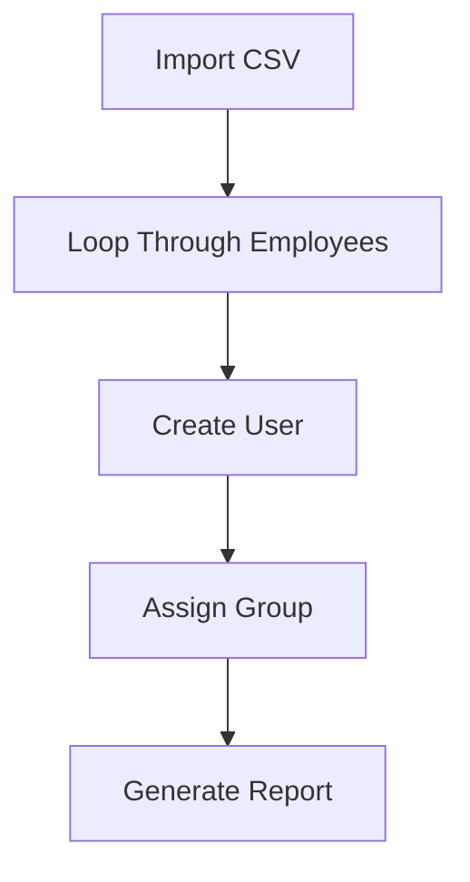

# IAM-Repository-Lab
PowerShell IAM automation scripts for user lifecycle management, RBAC, onboarding, reporting, and offboarding.

PowerShell IAM automation scripts for:
- User lifecycle management
- RBAC
- Automated onboarding
- CSV provisioning
- Reporting
- Offboarding workflows

---

# Technologies Used

- PowerShell
- Microsoft Entra ID
- CSV Automation
- RBAC
- User Lifecycle Management

---

# IAM Workflow

---

# Current Features

- Bulk user creation
- Group assignment automation
- CSV onboarding
- User reporting
- Mass offboarding
- RBAC simulations

---

# Repository Structure

- onboarding.ps1
- offboarding.ps1
- reporting.ps1
- bulk_user_creation.ps1

---

# Purpose

This lab was created to practice IAM concepts such as:

- Identity lifecycle management
- RBAC
- CSV-based provisioning
- PowerShell automation
- User onboarding and offboarding
